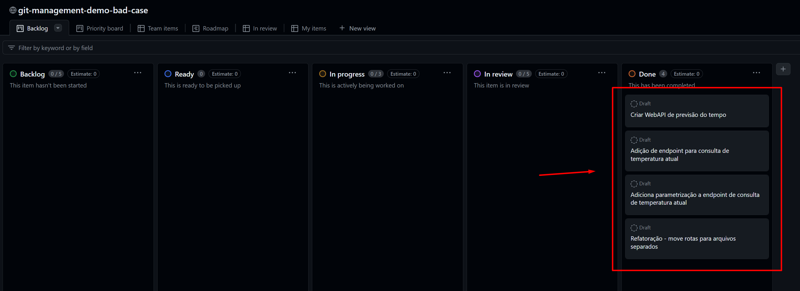
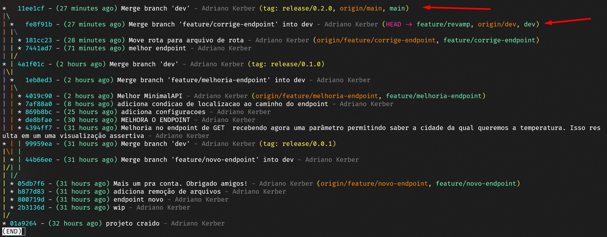

# git-management-demo-bad-case
Exemplo RUIM de gestão de código no git.

## Propósito

Este repositório visa mostrar um exemplo de má uso de commits, gerando uma falta de padrão nas mensagens, e fazendo um projeto perder completamente o rastreio das alterações em relação ao quadro de atividades do time.

## Elaborando o problema

Temos um quadro do time onde gerenciamos as atividades no fluxo de trabalho, priorizações, etc.
Dado o quadro e histórico do git exibidos nas imagens abaixo o que você entende?

Quadro do time:

Histórico do Git:

Elaborando um pouco mais:
Usamos git-flow e temos 2 branches de longa duração `main` e `dev` onde main representa o código de produção. Cada Tag representa uma release publicada em produção.

## Questionamentos

- Você conseguiria relacionar facilmente os 4 item de trabalho do quadro com os commits do histórico?
- Se você se esforçar um pouco mais, consegue fazer a relação?
- Hiiii, deu problema em produção, como identificar o que deu problema olhando esse histórico?